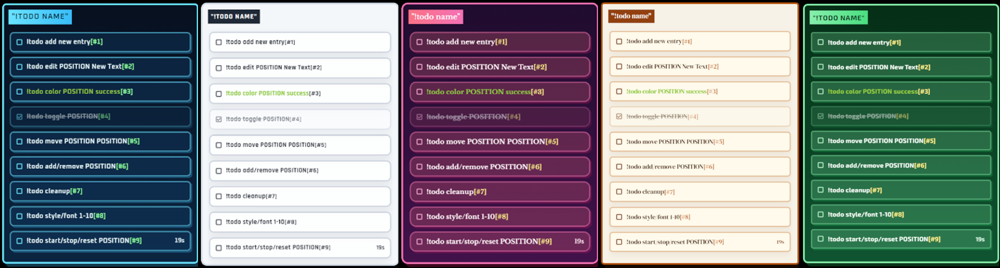

# Todo Overlay for OBS/Twitch



A browser-based Twitch chat controlled todo list for OBS browser sources.

This customized version extends the original project with:

- `10` built-in visual styles
- `10` font presets via chat command
- transparent overlay modes
- inline per-item timers
- multi-timer support
- persistent style/font/list state in browser storage

## Features

- Twitch chat controlled todo list for OBS browser sources
- broadcaster and mod-only command control
- `10` switchable visual styles with style-specific default fonts
- `10` font overrides via chat command
- transparent overlay variants for gameplay or camera scenes
- per-item color control with NES.css color names or raw CSS colors
- per-item timers rendered inline on the far right of each row
- multiple timers can run at the same time
- manual item highlight plus automatic timer emphasis
- persistent local state per command namespace
- multiple independent lists via the `command` query parameter

## Local Setup

```bash
npm install
npm run build
npm start
```

Local overlay URL:

```url
http://localhost:5000/?channelName=yourName
```

## OBS / Browser Source URL

Required query:

```url
https://csnnnn.github.io/?channelName=yourName
```

Available query options:

| Option | Description |
| - | - |
| `channelName` | Twitch channel to connect to |
| `command=todo` | Chat command namespace. Default is `todo` |
| `layout=full` | Overlay layout mode. Use `full` or `auto` |
| `scrollingInterval=5000` | Interval in ms before auto-scroll changes direction |
| `scrollingDuration=2000` | Scroll animation duration in ms |

Example:

```url
https://csnnnn.github.io/todo-overlay/?channelName=yourName&command=todo&layout=auto
```

Notes:

- the overlay listens to the Twitch channel set in `channelName`
- only the broadcaster and mods can control the list from chat
- changing `command` gives you a separate saved list and command namespace

## Chat Commands

Broadcaster and mods can control the overlay from chat.

`!COMMAND TEXT` is shorthand for:

```text
!COMMAND add TEXT
```

General syntax:

```text
!COMMAND SUBCOMMAND [ARGS]
```

### List Management

| Command | Shortcut | Description |
| - | - | - |
| `new TITLE` |  | Clears the list and renames it |
| `name TITLE` |  | Renames the list |
| `add TEXT` |  | Adds a new item |
| `edit POSITION TEXT` | `e` | Replaces item text |
| `remove POSITION` | `rm` | Removes an item |
| `move POSITION NEWPOSITION` | `mv` | Reorders an item |
| `toggle POSITION` |  | Toggles done state |
| `toggle 1,2,3` |  | Toggles multiple items at once |
| `cleanup` |  | Removes all done items |

### Styling

| Command | Description |
| - | - |
| `style 1` to `style 10` | Switches the overlay style |
| `font 1` to `font 10` | Overrides the current style font |
| `color POSITION COLOR` | Applies an NES.css text color or custom CSS color |

Supported `color` values:

- NES.css text names like `success`, `warning`, `error`, `primary`
- raw CSS colors like `#00ff88`, `rgb(255,0,0)`, `rgba(255,255,255,.8)`

### Highlighting

| Command | Shortcut | Description |
| - | - | - |
| `highlight POSITION` | `hl` | Highlights one item and fades the others |
| `highlight` | `hl` | Clears manual highlight |

### Timers

| Command | Description |
| - | - |
| `start POSITION` | Starts or resumes the timer for that item |
| `stop POSITION` | Stops that specific item timer |
| `reset POSITION` | Resets that specific item timer to zero |

Timer behavior:

- timers are per-item, not global
- multiple items can run timers at the same time
- active timers are shown inline on the far right of the item
- active timer rows get visual emphasis automatically
- stopped timers keep their saved elapsed time
- starting or stopping one timer does not affect the others

## Styles

| Style | Notes |
| - | - |
| `1` | Classic retro pixel panel |
| `2` | Sci-fi cyan |
| `3` | Arcade / playful neon |
| `4` | Clean light dashboard |
| `5` | Transparent text-only overlay |
| `6` | Rose / magenta editorial |
| `7` | Dark lime terminal |
| `8` | Warm editorial serif |
| `9` | Forest tech |
| `10` | Transparent monochrome card style |

Style-specific default fonts:

| Style | Default Font |
| - | - |
| `1` | `Press Start 2P` |
| `2` | `Oxanium` |
| `3` | `Fredoka` |
| `4` | `Rajdhani` |
| `5` | `Chakra Petch` |
| `6` | `Libre Baskerville` |
| `7` | `Space Grotesk` |
| `8` | `DM Serif Display` |
| `9` | `Exo 2` |
| `10` | `Bebas Neue` |

## Font Command Presets

`!todo font 1` through `!todo font 10` map to:

| Font Command | Font |
| - | - |
| `font 1` | `Press Start 2P` |
| `font 2` | `Russo One` |
| `font 3` | `Oxanium` |
| `font 4` | `Rajdhani` |
| `font 5` | `Chakra Petch` |
| `font 6` | `Libre Baskerville` |
| `font 7` | `Space Grotesk` |
| `font 8` | `DM Serif Display` |
| `font 9` | `Exo 2` |
| `font 10` | `Bebas Neue` |

Notes:

- switching style restores that style's default font
- using a `font` command overrides the current style font
- switching style again clears that font override and restores the new style default

## Persistence

The overlay stores data in browser `localStorage`.

That includes:

- list title
- items
- item colors
- item timer state
- selected style
- selected font override

Different `command` values use separate saved lists, so you can run multiple overlays like:

- `?command=todo`
- `?command=later`

## Project Structure

- `src/App.svelte`: reads URL options, connects to Twitch chat, and wires stores into the UI
- `src/command.handler.ts`: parses chat commands and updates list state
- `src/components/TaskList.svelte`: renders the full overlay layout and style themes
- `src/components/ListItem.svelte`: renders each task row, checkbox, colors, and inline timer
- `src/components/TimeDifference.svelte`: updates running timer text
- `src/items.store.ts`: persists items and options in browser storage

## Tips

1. Use the same overlay URL in an OBS custom dock if you want to monitor and manage it inside OBS.
2. Create multiple browser sources with different `command` values for separate lists.
3. Styles `5` and `10` are best when you want more transparent overlays over gameplay or camera.

## Credits

This project is based on [negue/todo-overlay](https://github.com/negue/todo-overlay) and keeps the original MIT license.
